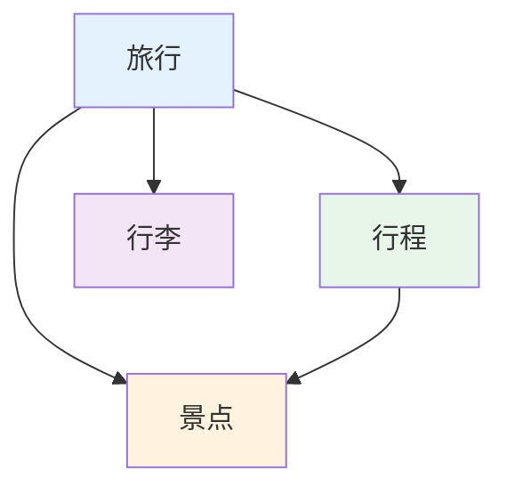

# 旅行记录：规划你的足迹版图

[https://fayeywg6llz.feishu.cn/minutes/obcnp28yzk4bs1g9h236i1d7?from=from_copylink](https://fayeywg6llz.feishu.cn/minutes/obcnp28yzk4bs1g9h236i1d7?from=from_copylink)

不知道你是不是也跟我一样：

- 每次旅行都是临时抱佛脚，匆匆忙忙没有规划？
- 想去的地方一大堆却不知道从哪里开始？
- 旅行照片散落各处找不到，回忆越来越模糊？
- 回想美好时光却记不起具体细节？

旅行记录板块，帮你建立一套完整的旅行管理系统——规划每次旅行、记录每个景点、整理每张照片，建立属于自己的足迹版图。

## 00｜模块概览

旅行记录板块包含 4个数据库：

- **旅行**：旅行管理中心，统筹每次出行的总体规划
- **行程**：每日行程安排，规划每天的具体活动
- **景点**：景点档案馆，记录每个去过或想去的地方
- **行李**：出行准备助手，管理旅行物品清单

## 01｜旅行

旅行数据库管理你的所有出行计划，从愿望清单到具体执行。

**核心字段**

| 字段 | 类型 | 说明 |
| --- | --- | --- |
| 旅行名称 | 标题 | 本次旅行的名称 |
| 出发时间 | 日期 | 旅行开始日期 |
| 结束时间 | 日期 | 旅行结束日期 |
| 状态 | 状态 | 愿望清单 → 计划中 → 出行中 → 已出行 → 取消 |
| 旅行类型 | 单选 | 出去玩 / 演唱会 / 散心 / 出差 / 其他 |
| 同行朋友 | 关联 | 关联人际圈（一起旅行的朋友） |
| 旅行照片 | 文件 | 本次旅行的精选照片 |
| 行程/景点/行李 | 关联 | 关联本次旅行的所有行程、景点、行李 |

**状态说明**

<aside>

**愿望清单**：想去但还没计划

</aside>

<aside>

**出行中**：正在旅行途中

</aside>

<aside>

**计划中**：正在制定详细计划

</aside>

<aside>

**已出行**：旅行已完成

</aside>

**如何操作**

1. 点击「+ 新建」创建旅行计划
2. 填写旅行名称、时间、类型
3. 添加同行朋友
4. 随着旅行推进更新状态

## 02｜行程

行程数据库管理旅行中的每日具体安排。

**核心字段**

| 字段 | 类型 | 说明 |
| --- | --- | --- |
| 行程名称 | 标题 | 自动生成（如「Day 1: 北京→上海」） |
| 行程日 | 单选 | Day 1 / Day 2 / Day 3... |
| 出发地 | 文本 | 当天的出发城市/地点 |
| 目的地 | 文本 | 当天的目的城市/地点 |
| 旅行 | 关联 | 关联所属的旅行 |
| 景点 | 关联 | 关联当天要去的景点 |
| 路线 | 公式 | 自动生成「出发地 → 目的地」 |
| 完成 | 复选框 | 当天行程是否完成 |

**如何操作**

1. 旅行计划确定后，创建详细行程
2. 设置行程日（Day 1、Day 2等）
3. 填写出发地和目的地
4. 关联当日要去的景点
5. 旅行过程中更新完成状态

## 03｜景点

景点数据库记录每一个去过或想去的地方。

**核心字段**

| 字段 | 类型 | 说明 |
| --- | --- | --- |
| 景点名称 | 标题 | 景点/餐厅/商店名称 |
| 旅行 | 关联 | 关联所属的旅行 |
| 行程 | 关联 | 关联所属的行程 |
| 第几站 | 数字 | 当天的第几个景点 |
| 类型 | 单选 | 美食 / 景点 / 购物 / 演出 / 游玩 / 住宿 / 出行 |
| 状态 | 状态 | 愿望清单 → 计划中 → 出行中 → 已出行 → 取消 |
| 预计日期 | 日期 | 计划去的日期 |
| 实际日期 | 日期 | 实际去的日期 |
| 风景图 | 文件 | 景点照片 |
| 备注 | 文本 | 游玩感受、推荐理由等 |

**景点类型说明**

<aside>

**美食**：

餐厅、小吃、特产

</aside>

<aside>

**景点**：

景区、古迹、自然风光

</aside>

<aside>

**购物**：

商场、市场、特产店

</aside>

<aside>

**演出**：

演唱会、表演、展览

</aside>

**如何操作**

1. 规划时：添加想去的景点到愿望清单
2. 制定行程时：将景点状态改为「计划中」
3. 旅行过程中：更新为「出行中」并上传照片
4. 旅行结束后：标记为「已出行」并补充备注

## 04｜行李

行李数据库帮你管理每次旅行的物品准备。

**核心字段**

| 字段 | 类型 | 说明 |
| --- | --- | --- |
| 行李清单名称 | 标题 | 行李清单名称 |
| 旅行 | 关联 | 关联所属的旅行 |
| 衣物清单 | 关联 | 关联衣物数据库（需要带的衣服） |
| 产品用品 | 关联 | 关联产品数据库（洗漱用品、电子设备等） |
| 是否收拾完毕 | 复选框 | 行李是否已准备完成 |

**如何操作**

1. 旅行确定后创建对应的行李清单
2. 根据旅行类型和天气添加所需衣物
3. 添加必需的产品用品
4. 收拾行李时逐项核对
5. 出发前确认「是否收拾完毕」

## 05｜核心工作流

### 旅行规划流程

> 为什么重要：详细的规划让旅行更充实，避免到了地方不知道干什么。
> 

**`旅行创建 → 景点收集 → 行程安排 → 行李准备 → 出发`**

**具体操作流程：**

1. **旅行创建**：在旅行数据库新建计划，设置基本信息
2. **景点收集**：添加想去的景点到愿望清单
3. **行程安排**：制定每日行程，关联景点
4. **行李准备**：创建行李清单，确保物品齐全
5. **出发旅行**：更新状态为「出行中」

### 旅行执行流程

> 为什么重要：及时记录让回忆更加完整。
> 

**`查看行程 → 景点打卡 → 照片记录 → 状态更新 → 体验备注`**

**具体操作流程：**

1. **查看行程**：查看当天的行程安排和景点
2. **景点打卡**：到达后更新状态为「出行中」
3. **照片记录**：上传风景照片
4. **状态更新**：游览完成后标记为「已出行」
5. **体验备注**：记录游玩感受和推荐理由

### 足迹回顾流程

> 为什么重要：定期回顾让旅行的美好持续延续。
> 

**`足迹统计 → 照片整理 → 回忆分享 → 经验总结 → 下次规划`**

**具体操作流程：**

1. **足迹统计**：通过统计视图回顾旅行版图
2. **照片整理**：为每个景点添加精选照片
3. **回忆分享**：与同行朋友分享美好时光
4. **经验总结**：记录旅行心得和建议
5. **下次规划**：基于经验规划下一次旅行

## 06｜课后任务

**任务一：记录一次过往旅行**

- [ ]  在「旅行」数据库中添加一次已完成的旅行
- [ ]  设置状态为「已出行」，添加旅行照片
- [ ]  回忆并添加去过的景点

**任务二：创建一个愿望清单**

- [ ]  添加3-5个你想去但还没去的地方
- [ ]  设置状态为「愿望清单」
- [ ]  选择一个开始规划具体行程

**任务三：建立行李模板**

- [ ]  创建一个通用行李清单
- [ ]  添加你出行必带的物品
- [ ]  下次旅行时复用这个模板

希望这套旅行记录系统能成为你探索世界路上最贴心的伙伴。